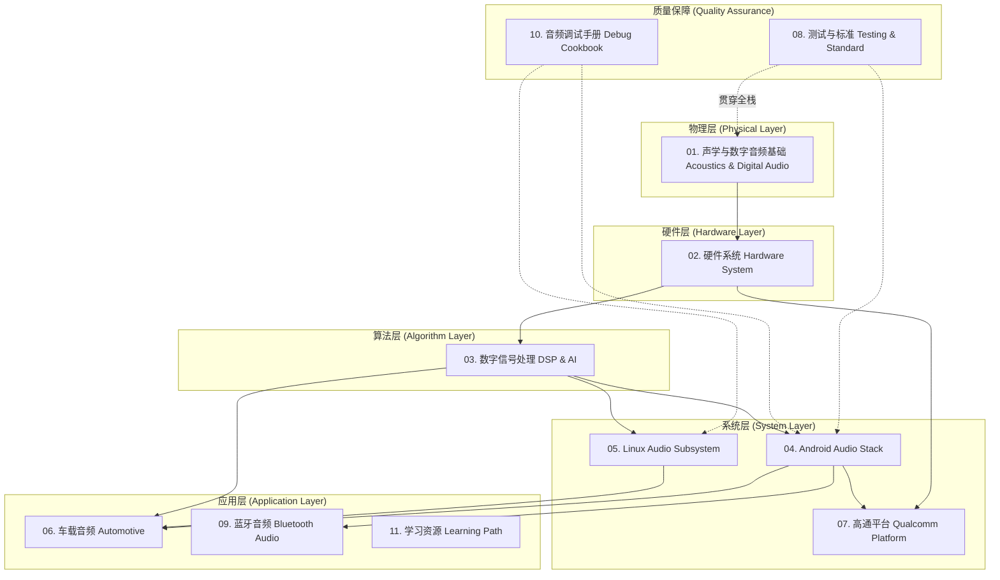

# Awesome Audio Knowledge Base

> **全方位、深层次、实战化的音频技术开源知识库**
>
> 涵盖声学基础、数字信号处理、Android/Linux音频栈、车载音频、高通架构及行业标准。

欢迎来到 **Awesome Audio Knowledge Base**！这是一个致力于打造全网最全面、最专业、最体系化的音频技术开源知识库。

本项目采用**自底向上**的技术栈分层架构（Scheme A），从最基础的声波物理特性，一路深入到复杂的软硬件系统架构，涵盖手机（Mobile）、车机（Automotive）、IoT 等多领域音频技术。

---

## 📚 知识架构导览 (Knowledge Architecture)

下面是本知识库的模块关系图：

---

## 📂 目录索引 (Table of Contents)

点击下方链接进入各个模块的深度学习：

### [01. 声学与数字音频基础 (Acoustics & Digital Audio)](./01-Acoustics-Digital-Audio)
一切音频技术的根基。
*   声波物理特性 (Sound Wave Physics)
*   心理声学 (Psychoacoustics)
*   数字音频基础 (ADC/DAC 原理, 采样率, 位深, PCM)
*   音频软件核心概念：Frame / Sample / Buffer / Period / Latency 与代码实例

### [02. 硬件系统 (Hardware System)](./02-Hardware-System)
涵盖手机、车载、工业音频硬件拓扑。
*   麦克风 (Microphone) 与扬声器 (Speaker) 原理
*   编解码器 (Codec) 与 放大器 (Amplifier/SmartPA)
*   音频接口总线 (Audio Interface & Bus): I2S, TDM, PDM, SoundWire
*   车载特有硬件: A2B 总线
*   Codec 芯片专题 (WCD938x / CS系列) 与 SmartPA IV-Sense 闭环保护
*   USB 音频: UAC 协议、等时传输、snd-usb-audio 驱动、Android USB Audio HAL、Type-C 音频

### [03. 数字信号处理与算法 (Digital Signal Processing & Algorithms)](./03-Digital-Signal-Processing)
从传统信号处理到现代 AI 语音交互。
*   语音通信 3A 算法: 回声消除 (AEC), 降噪 (ANS), 自动增益控制 (AGC)
*   音效处理: 均衡器 (EQ), 混响 (Reverb), 动态范围控制 (DRC)
*   语音交互: 语音唤醒 (KWS), 语音识别 (ASR), 文本转语音 (TTS), 自然语言理解 (NLU)
*   空间音频深度解析: HRTF、Ambisonics、Dolby Atmos、头部追踪
*   AI 音频处理: AI 降噪、NN-AEC、端侧部署 (TFLite/SNPE/QNN)、神经编解码 (EnCodec)

### [04. Android 音频架构 (Android Audio Stack)](./04-Android-Audio-Stack)
针对 Android 音频系统的手术级拆解。
*   音频数据流向全景图 (Audio Data Flow)
*   AudioTrack / AudioRecord 深度解析
*   AudioFlinger 深度解析: Track 状态机、FastTrack vs NormalTrack、重采样器、Buffer 链路、Dump 实战
*   AudioPolicy 深度解析: XML 完整解析、路由决策全链路、Engine 架构、设备连接处理、AudioPatch
*   Audio HAL: HIDL/AIDL 接口规范与实现
*   Oboe / AAudio 低延迟音频 API 与 MMAP 独占路径
*   VoIP 与通话链路: VoLTE/VoNR 全链路、VoIP App 架构、通话 3A、Jitter Buffer、通话质量评估

### [05. Linux 音频子系统 (Linux Audio Subsystem)](./05-Linux-Audio-Subsystem)
底层驱动与中间件。
*   ALSA (Advanced Linux Sound Architecture) 核心架构
*   ASoC 深度解析：DAPM 状态机 / Widget 图 / 电源序列 / FE-BE DPCM / DMA 传输 / Device Tree 绑定
*   TinyALSA 原理与使用
*   PulseAudio / PipeWire 简介

### [06. 车载音频系统 (Automotive Audio)](./06-Automotive-Audio)
智能座舱多音区交互、安全优先级与复杂路由。
*   车载音频概览与仲裁矩阵 (Arbitration Matrix)
*   多音区 (Audio Zones) 与基于 Bus 的动态路由
*   车载自定义焦点 (CarAudioFocus) 与音量组管理 (Volume Groups)
*   主动降噪与路噪消除 (ANC/RNC)：FxLMS 算法、MIMO 架构、ESE 声浪模拟
*   AudioControl HAL 与 AAOS 架构演进：AIDL 接口、Hypervisor 多 OS 隔离、AVB/TSN
*   高通车载音频平台 (SA8295)：多域架构、Bringup 流程、TDM 配置、车载 AudioReach Graph、HFP 通话
*   SOME/IP 音频传输：以太网音频方案选型 (SOME/IP vs AVB/TSN)、Jitter Buffer、vsomeip 实践

### [07. 高通平台专题 (Qualcomm Platform)](./07-Qualcomm-Platform)
深度解析高通平台的专有音频技术。
*   AudioReach 框架深度解析
*   ADSP (Audio DSP) 拓扑与图形化开发工具
*   CAPI 自定义模块开发 (vtable 接口、process 实现、AMDB 注册)
*   GEF 通用音效框架 (第三方音效集成、Use Case 绑定)
*   低功耗语音唤醒 LPI (多级 KWD、Lab Buffer、SoundTrigger HAL)
*   QACT 调试与工具链 (实时调参、QXDM/QCAT 日志分析、ADB 命令)

### [08. 测试与质量标准 (Testing, Quality & Standard)](./08-Testing-Quality-Standard)
音频客观测试指标与行业标准。
*   音频客观指标: THD+N, SNR, 频响曲线等
*   常用测试仪器 with 方法 (Audio Precision 等)
*   ITU-T 行业通信标准简介
*   测试工具实操: AP 自动化、PESQ/POLQA、MOS 主观评价、Python 分析脚本
*   Android CTS/VTS 音频测试: 高频失败用例解析、自动化框架、CI 集成、压力测试

### [09. 蓝牙音频 (Bluetooth Audio)](./09-Bluetooth-Audio)
从经典蓝牙到 LE Audio 的完整技术栈。
*   蓝牙音频协议栈：A2DP / HFP / LE Audio (BAP/CAP/TMAP)
*   编解码器对比：SBC / AAC / aptX / LDAC / LC3 原理与音质
*   Auracast 广播音频与 Isochronous Channels 传输机制
*   Android BT Audio HAL：AIDL 接口、A2DP 数据通路、LE Audio 集成
*   蓝牙音频调试：btsnoop HCI log 分析、codec 协商诊断
*   LE Audio 专题: LC3/LC3plus 编解码、CIS/BIS 等时通道、Auracast、TWS CSIP

### [10. 音频调试手册 (Audio Debug Cookbook)](./10-Audio-Debug-Cookbook)
全链路音频调试的系统方法论与实战 Cookbook。
*   分层定位模型：App → Framework → HAL → Driver → Hardware
*   核心工具速查：dumpsys 全家桶、logcat TAG、procfs/sysfs
*   Perfetto 音频 trace：抓取方法、关键事件、调度分析
*   常见问题 Cookbook：无声、爆音、延迟、功耗、路由异常诊断流程图
*   audioserver Crash/ANR 分析：Tombstone 解读、死锁诊断
*   音频功耗优化：Offload 卸载、AP Suspend、LPI 低功耗岛、DAPM 电源管理
*   音频稳定性分析：Native Crash / ADSP SSR / ANR / 内存问题 / 防护最佳实践

### [11. 学习路径与资源 (Learning Path & Resources)](./11-Learning-Path-Resources)
如何系统化自学及行业参考。
*   从小白到专家的推荐书单与教程
*   四大方向（Android/车载/蓝牙/驱动）推荐阅读路径
*   分方向书单：Android/Linux/蓝牙/车载/DSP/声学
*   优秀开源项目与代码库（WebRTC, Oboe, TinyALSA, PipeWire）
*   常用的音频分析工具 (Audacity, REW, AP 等)
*   音频技术大会与认证课程（AES, ELC, Bluetooth World）
*   面试高频知识点 Top 20、Android 音频调试命令速查手册、Python 分析脚本集

### [📖 音频术语表 (Glossary)](./Glossary.md)
100+ 核心缩写与术语索引，按字母顺序排列，快速查阅。

---

## 🛠️ 内容编写规范 (Contribution Guidelines)

为了保证本知识库的高质量与专业性，所有文档必须遵循以下标准：
1.  **经典技术文档结构**：概念定义 -> 核心原理解析 -> 流程图/架构图 (Mermaid) -> 关键代码/配置示例 -> 参考资料。
2.  **专业且易懂**：深入剖析原理，但语言应通俗易懂，层次递进。
3.  **图文并茂**：大量使用 Mermaid 绘制流程图、时序图、架构图。
4.  **中英结合**：主体使用纯中文，关键技术术语必须保留英文（如：`回声消除 (AEC)`）。
5.  **严谨准确**：宁缺毋滥，拒绝含糊其辞或错误的知识点。

---

## 🚀 如何使用本知识库 (How to Use)

1.  **系统学习**：建议按照目录索引从 `01` 到 `11` 循序渐进地阅读，或参考 `11` 模块中的分方向阅读路径。
2.  **按需查阅**：Android 开发者直奔 `04`；车载音频重点阅读 `02` 和 `06`；蓝牙音频请看 `09`；遇到问题直接查 `10` 调试手册。
3.  **实践验证**：本库中包含大量 `adb` 命令和代码片段，建议配合真机或开发板进行验证。

---

## 🤝 贡献与反馈 (Contribution)

欢迎加入共同完善这个音频百科全书！
*   **提交 Issue**：发现错误或有疑问，请提交 Issue。
*   **提交 PR**：如果你有新的硬核知识点（如：蓝牙音频 LE Audio、特定平台的 DSP 优化），欢迎提交 Pull Request。

---
*Created with ❤️ for the Audio Developer Community.*
