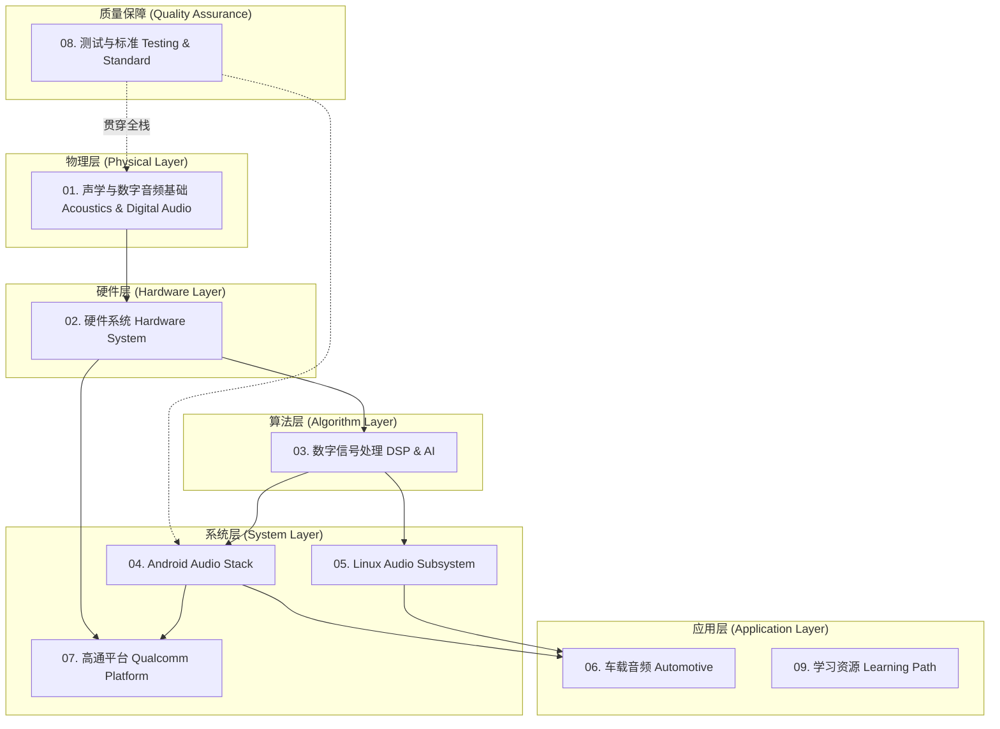

# Awesome Audio Knowledge Base

> **全方位、深层次、实战化的音频技术开源知识库**
>
> 涵盖声学基础、数字信号处理、Android/Linux音频栈、车载音频、高通架构及行业标准。

欢迎来到 **Awesome Audio Knowledge Base**！这是一个致力于打造全网最全面、最专业、最体系化的音频技术开源知识库。

本项目采用**自底向上**的技术栈分层架构（Scheme A），从最基础的声波物理特性，一路深入到复杂的软硬件系统架构，涵盖手机（Mobile）、车机（Automotive）、IoT 等多领域音频技术。

---

## 📚 知识架构导览 (Knowledge Architecture)

下面是本知识库的模块关系图：

---

## 📂 目录索引 (Table of Contents)

点击下方链接进入各个模块的深度学习：

### [01. 声学与数字音频基础 (Acoustics & Digital Audio)](./01-Acoustics-Digital-Audio)
一切音频技术的根基。
*   声波物理特性 (Sound Wave Physics)
*   心理声学 (Psychoacoustics)
*   数字音频基础 (ADC/DAC 原理, 采样率, 位深, PCM)

### [02. 硬件系统 (Hardware System)](./02-Hardware-System)
涵盖手机、车载、工业音频硬件拓扑。
*   麦克风 (Microphone) 与扬声器 (Speaker) 原理
*   编解码器 (Codec) 与 放大器 (Amplifier/SmartPA)
*   音频接口总线 (Audio Interface & Bus): I2S, TDM, PDM, SoundWire
*   车载特有硬件: A2B 总线

### [03. 数字信号处理与算法 (Digital Signal Processing & Algorithms)](./03-Digital-Signal-Processing)
从传统信号处理到现代 AI 语音交互。
*   语音通信 3A 算法: 回声消除 (AEC), 降噪 (ANS), 自动增益控制 (AGC)
*   音效处理: 均衡器 (EQ), 混响 (Reverb), 动态范围控制 (DRC)
*   空间音频 (Spatial Audio) 基础
*   语音交互: 语音唤醒 (KWS), 语音识别 (ASR), 文本转语音 (TTS), 自然语言理解 (NLU)

### [04. Android 音频架构 (Android Audio Stack)](./04-Android-Audio-Stack)
针对 Android 音频系统的手术级拆解。
*   音频数据流向全景图 (Audio Data Flow)
*   AudioTrack / AudioRecord 深度解析
*   AudioFlinger: 混音引擎与播放线程分析
*   AudioPolicy: 路由策略与音量管理
*   Audio HAL: HIDL/AIDL 接口规范与实现

### [05. Linux 音频子系统 (Linux Audio Subsystem)](./05-Linux-Audio-Subsystem)
底层驱动与中间件。
*   ALSA (Advanced Linux Sound Architecture) 核心架构
*   ASoC (ALSA System on Chip)
*   TinyALSA 原理与使用
*   PulseAudio / PipeWire 简介

### [06. 车载音频系统 (Automotive Audio)](./06-Automotive-Audio)
车载特有的复杂音频拓扑与逻辑。
*   车载音频系统概述
*   Android Automotive VHAL 与音频交互
*   多音区系统设计 (Multi-zone Audio)
*   复杂的音频路由策略 (Audio Routing)

### [07. 高通平台专题 (Qualcomm Platform)](./07-Qualcomm-Platform)
深度解析高通平台的专有音频技术。
*   AudioReach 框架深度解析
*   ADSP (Audio DSP) 拓扑与图形化开发工具
*   高通音频调试方法

### [08. 测试与质量标准 (Testing, Quality & Standard)](./08-Testing-Quality-Standard)
音频客观测试指标与行业标准。
*   音频客观指标: THD+N, SNR, 频响曲线等
*   常用测试仪器 with 方法 (Audio Precision 等)
*   ITU-T 行业通信标准简介

### [09. 学习路径与资源 (Learning Path & Resources)](./09-Learning-Path-Resources)
如何系统化自学及行业参考。
*   从小白到专家的推荐书单与教程
*   优秀的开源项目与代码库
*   常用的音频分析工具 (Audacity, Adobe Audition 等)

---

## 🛠️ 内容编写规范 (Contribution Guidelines)

为了保证本知识库的高质量与专业性，所有文档必须遵循以下标准：
1.  **经典技术文档结构**：概念定义 -> 核心原理解析 -> 流程图/架构图 (Mermaid) -> 关键代码/配置示例 -> 参考资料。
2.  **专业且易懂**：深入剖析原理，但语言应通俗易懂，层次递进。
3.  **图文并茂**：大量使用 Mermaid 绘制流程图、时序图、架构图。
4.  **中英结合**：主体使用纯中文，关键技术术语必须保留英文（如：`回声消除 (AEC)`）。
5.  **严谨准确**：宁缺毋滥，拒绝含糊其辞或错误的知识点。

---

## 🚀 如何使用本知识库 (How to Use)

1.  **系统学习**：建议按照目录索引从 `01` 到 `09` 循序渐进地阅读。
2.  **按需查阅**：如果你是 Android 开发者，可直奔 `04` 模块；如果你关注车载音频，请重点阅读 `02` 和 `06` 模块。
3.  **实践验证**：本库中包含大量 `adb` 命令和代码片段，建议配合真机或开发板进行验证。

---

## 🤝 贡献与反馈 (Contribution)

欢迎加入共同完善这个音频百科全书！
*   **提交 Issue**：发现错误或有疑问，请提交 Issue。
*   **提交 PR**：如果你有新的硬核知识点（如：蓝牙音频 LE Audio、特定平台的 DSP 优化），欢迎提交 Pull Request。

---
*Created with ❤️ for the Audio Developer Community.*
